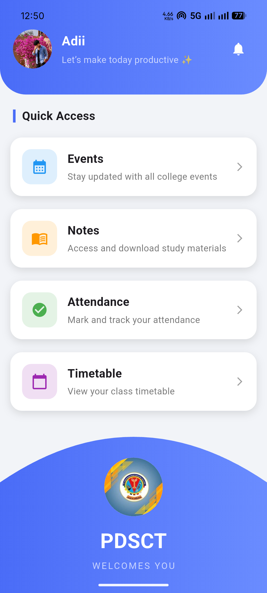
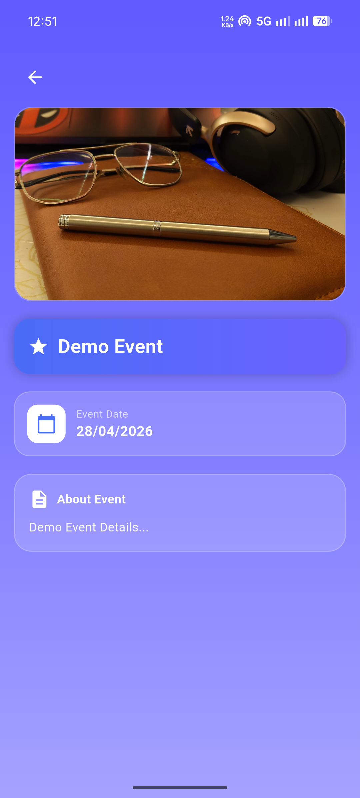
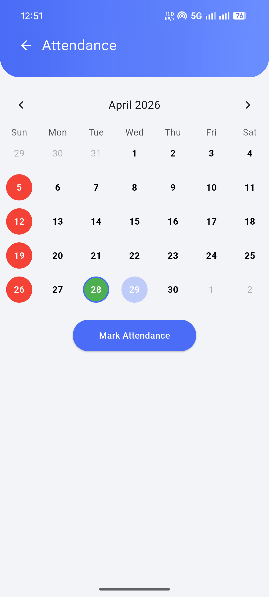

  

# 🎓 PDSCT.ac (Flutter)

A modern college management app built using Flutter, designed to manage events, attendance, notes, profile, and timetable with a clean and premium UI.
( Currently designed for Pt. Devprabharkar Shastri College Of Technology, Chhatarpur. )

---

## ✨ Features

### 🏠 Home
- Clean dashboard UI
- Quick navigation to modules
- Profile access from top bar

---

### 📅 Events
- Add events with poster
- Delete events
- Stylish event cards
- Detailed event view with gradient UI

---

### 📊 Attendance
- Interactive calendar
- Mark attendance using:
    - 📸 Live photo
    - 📍 Location (in progress)
- Sundays highlighted as holidays
- Current day indicator

---

### 🕒 Timetable (NEW)
- 📚 Lecture timetable view
- 📝 Exam timetable support
- Organized schedule display
- (Future: dynamic timetable updates)

---

### 👤 Profile
- Edit user details:
    - Name
    - Year
    - Branch
    - Semester
    - Phone
    - Email
- Profile picture upload
- Data stored locally (SharedPreferences)
- Logout functionality

---

## 📸 Screenshots

  
  
  

### 📝 Notes
- Structured notes section
- Expandable content

---

## 🛠️ Tech Stack

- Flutter
- Dart
- SharedPreferences
- Image Picker
- Table Calendar
- Git & GitHub

---

## 🚀 Getting Started

1. Clone the repository
   git clone https://github.com/Axite7/PDSCT.ac.git

2. Open project 
- cd college_app

3. Install dependencies
- flutter pub get

4. Run the app
- flutter run

---

## ⚙️ Requirements

- Flutter SDK
- Android Studio / VS Code
- Emulator or Physical Device

---

## 🔥 Future Improvements

- Firebase backend integration
- Admin panel
- Real-time attendance tracking
- Push notifications
- Cloud storage for images
- Smart timetable updates

---

## 👨‍💻 Developer

Aditya Shukla & Dileep Rathore

---

## ⭐ Support

If you like this project:

- Star the repository
- Share it
- Build on top of it

---

